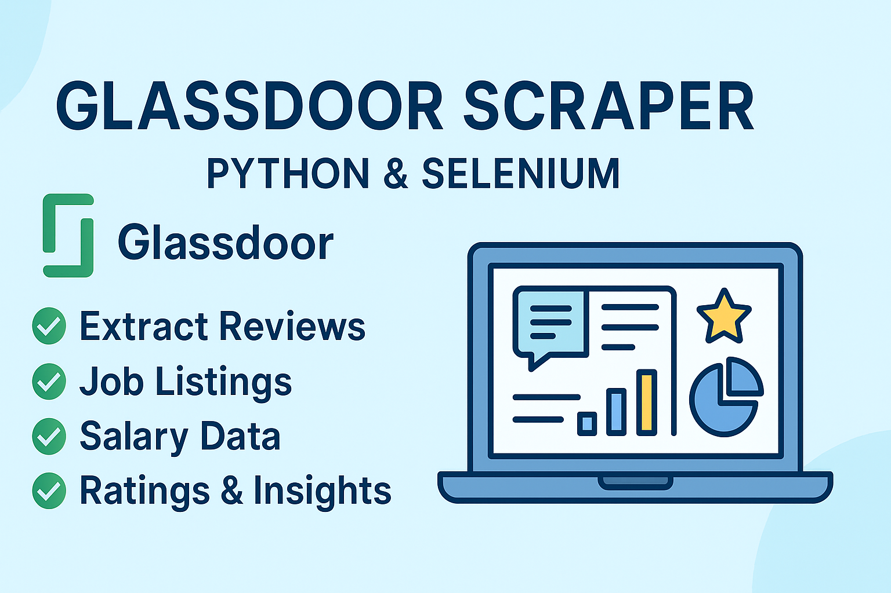

#  Glassdoor Scraper – Python & Selenium

  
  
  

Glassdoor scraper built with Python and Selenium to extract reviews, job listings, salaries, ratings, and company insights. Automates data collection into structured JSON/CSV formats for research, analysis, and market intelligence.

  

## Introduction
The **Glassdoor Scraper** is an open-source tool built with **Python + Selenium** to extract:
- :white_check_mark: Company reviews
- :white_check_mark: Job listings
- :white_check_mark: Salary data
- :white_check_mark: Ratings & insights
Instead of wasting hours copying data manually, this scraper automates everything and gives you **structured JSON/CSV output** ready for analysis.
---
## Features
| Feature              | Description                                  |
|-----------------------|----------------------------------------------|
| Multi-Account Support | Run multiple accounts at once                |
| Review Extraction     | Collect detailed job & company reviews       |
| Salary Scraper        | Extract salary ranges & compensation data    |
| Human-Like Actions    | Random delays + scrolling to reduce bans     |
| Scalability           | Scrape hundreds or thousands of pages safely |
---

  

---

## Architecture

  

##  Success Stories & Testimonials  

###  Client Results  
> "The Glassdoor Scraper saved our research team over **200+ hours** of manual work. We automated data collection for **50+ companies in just one week!**"  
> *– Market Research Agency*  

> "Our HR analytics dashboard is now powered with **live salary data** from Glassdoor. Recruiting insights improved instantly, helping us benchmark offers with accuracy."  
> *– HR Tech Startup*  

> "Integration was seamless. We scaled **job listings data collection 5x faster** within our existing Python pipeline."  
> *– Data Science Consultancy*  

---

###  Performance Metrics  
-  **80% faster** data collection vs. manual effort  
-  **100k+ reviews & salaries extracted** across industries  
-  **70% reduction** in research overhead costs  
-  **5x scalability** with Selenium automation  
-  **99% accuracy** in structured JSON/CSV exports  

## Contact  

  
  
  

##

>Found this scraper useful? Star the repository and help others discover it!

>Need a custom Glassdoor scraping solution? Contact me today for a free consultation and tailored quote.

>Glassdoor Scraper – Reliable Job, Review & Salary Data Extraction built with Python & Selenium
